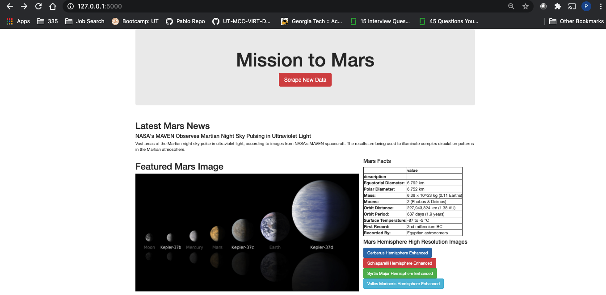
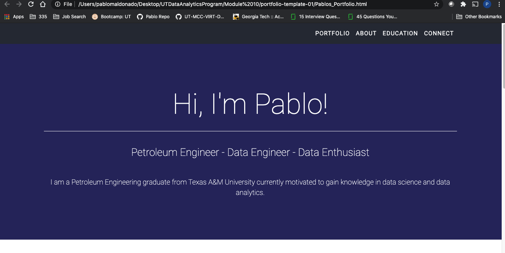

# Mission-to-Mars

## Resources
    - Software Platform: Python 3.7.6, conda 4.8.3, Visual Studio Code 1.47.2, Jupyter Notebook 6.0.3

### Challenge Objective
In this weeks challenge, we were tasked with adding high definition images of mars hemispheres to our mars html page. This was done by finding the image links using google chrome and web scraping. The flask app.py file and html templates were updated in order to reflect new links to the four hemisphere images. The code can be found in the attached files and a screenshot of the updated web page can be viewed below.

### Mars Website Screenshot

### My Portfolio Screenshot
